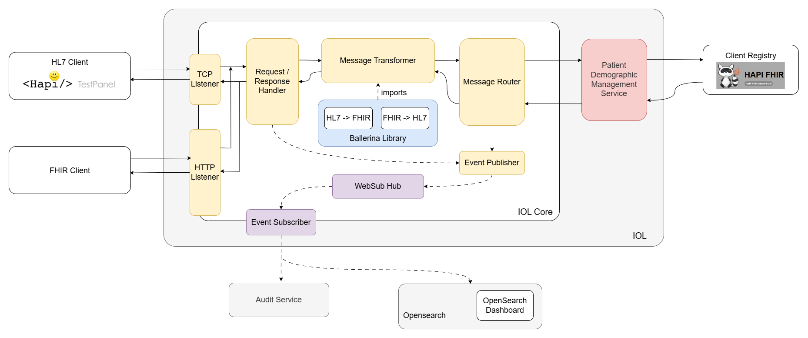

# OpenHIE-Interoperability Layer Reference Implementation

This repository contains the reference implementation of the OpenHIE Interoperability Layer (IOL). The IOL facilitates the exchange of health information between different systems and services, ensuring interoperability and seamless data flow.

## Table of Contents

- [Features](#features)
- [Architecture](#architecture)
- [Running the Services](#running-the-services)
- [Endpoints](#endpoints)

## Features

- **FHIR Support**: Supports FHIR-based interactions for patient demographics and other healthcare data.
- **HL7v2 Support**: Handles HL7v2 messages for various healthcare workflows.
- **Audit Logging**: Logs audit events and transactions for monitoring and compliance.
- **WebSub Hub**: Uses WebSub for event-driven communication and notifications.
- **OpenSearch Integration**: Publishes audit and transaction logs to OpenSearch for indexing and search.

## Architecture

The architecture consists of several components:



- **TCP Listener**: Receives HL7v2 messages and routes them to the appropriate services.
- **HTTP Listener**: Handles FHIR-based HTTP requests and routes them to the appropriate services.
- **Router**: Determines the appropriate route for incoming messages and forwards them to the target services.
- **Audit Service**: Logs audit events and publishes them to the WebSub hub and OpenSearch.
- **WebSub Hub**: Manages subscriptions and notifications for event-driven communication.

## Running the Services

1. Start WebSubHub  
   ```sh
   cd websubhub/hub
   bal run
2. Start IoL Core   
   ```sh
   cd iol-core
   bal run
3. Start Audit Service  
   ```sh
   cd audit-service
   bal run
4. Start FHIR Workflow  
   ```sh
   cd fhir-workflows/patient-demographic-management-service
   bal run
5. Navigate to OpenSearch directory and run `docker-compose up`

for opensearch dashboard,
```
USERNAME="admin"
PASSWORD="openHIEdemo!123"
```

## Endpoints

- HTTP Listener : ```http://localhost:9080```
- TCP Listener : ```tcp://localhost:9081```
- Audit Service : ```http://localhost:9091/audit```
- WebSub Hub : ```http://localhost:9095/hub```
- OpenSearch Dashboard : ```http://localhost:5601```
