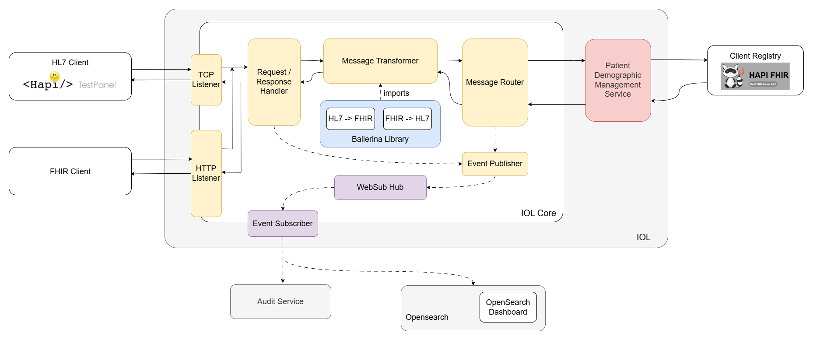

# OpenHIE-Interoperability Layer Reference Implementation

This repository contains the reference implementation of the OpenHIE Interoperability Layer (IOL). The IOL facilitates the exchange of health information between different systems and services, ensuring interoperability and seamless data flow.

## Table of Contents

- [Features](#features)
- [Architecture](#architecture)
- [Client Registry](#client-registry)
- [Prerequisites](#prerequisites)
- [Running the Services](#running-the-services)
- [Endpoints](#endpoints)

## Features

- **FHIR Support**: Supports FHIR-based interactions for patient demographics and other healthcare data.
- **HL7v2 Support**: Handles HL7v2 messages for various healthcare workflows.
- **Audit Logging**: Logs audit events and transactions for monitoring and compliance.
- **WebSub Hub**: Uses WebSub for event-driven communication and notifications.
- **OpenSearch Integration**: Publishes audit and transaction logs to OpenSearch for indexing and search.

## Architecture

The architecture consists of several components:



- **TCP Listener**: Receives HL7v2 messages and routes them to the appropriate services.
- **HTTP Listener**: Handles FHIR-based HTTP requests and routes them to the appropriate services.
- **Router**: Determines the appropriate route for incoming messages and forwards them to the target services.
- **Audit Service**: Logs audit events and publishes them to the WebSub hub and OpenSearch.
- **WebSub Hub**: Manages subscriptions and notifications for event-driven communication.

## Client Registry

The **Client Registry (CR)** is a standards-based Master Patient Index (MPI) for managing FHIR R4 Patient resources within the HIE. It implements IHE PDQm/PIXm transactions with intelligent patient matching and deduplication.

### CR Components

- **cr-core** — Ballerina FHIR R4 backend MPI service
- **cr-frontend** — React management UI for patient search, deduplication review, and audit log viewing
- **audit-service** — FHIR AuditEvent service for compliance logging 

### CR Features

- IHE transaction support: ITI-78 (Patient Demographics Query), ITI-104 (Patient Identity Feed), ITI-119 (Patient Demographics Match)
- Blocking-based patient deduplication with Union-Find grouping and admin review
- Four matching algorithms: exact, levenshtein, soundex, jarowinkler — with configurable per-field weights
- OIDC authentication (Asgardeo, Keycloak, Auth0, Okta, Azure AD) plus simulated auth for development

For full documentation see [cr/README.md](cr/README.md).

### Running the Client Registry

```bash
cd cr
bash start.sh
```

Or start services individually:

1. Start CR Audit Service
   ```sh
   cd cr/audit-service
   bal run
   ```
2. Start CR Core (MPI backend)
   ```sh
   cd cr/cr-core
   bal run
   ```
3. Start CR Frontend
   ```sh
   cd cr/cr-frontend
   npm install && npm run dev
   ```

### CR Endpoints

| Service | URL |
|---|---|
| MPI Backend (FHIR R4) | `http://localhost:9090/fhir/r4` |
| CR Audit Service | `http://localhost:9093` |
| CR Frontend UI | `http://localhost:5173` |

## Prerequisites

| Requirement | Details |
|---|---|
| [Ballerina](https://ballerina.io/downloads/) | Swan Lake (tested on 2201.13.1) |
| [Docker](https://www.docker.com/products/docker-desktop/) | For OpenSearch via Docker Compose |
| [Git Bash](https://git-scm.com/downloads) | **Windows only** — required to run `setup.sh` |
| [Node.js](https://nodejs.org/) 18+ | For the CR Frontend (cr-frontend) |
| [npm](https://www.npmjs.com/) 9+ | For the CR Frontend (cr-frontend) |

> **Windows users:** Run the script with `bash` (Git Bash), not `sh` or PowerShell. The script calls `bal.bat` which is only resolvable in a Bash environment with the Ballerina `bin` directory on PATH.

## Running the Services

Run the setup.sh script to run all the services for the OpenHIE Interoperability Layer Reference Implementation.

```bash
bash setup.sh
```

**Note:** The setup script will start all services in the background using their default ports. Logs for each service can be found in the `logs` directory.

**Note:** To access opensearch dashboard,
```
USERNAME="admin"
PASSWORD="openHIEdemo!123"
```
Use global Tenant and go to dashboards and select `openhie-ref-impl`

If you want to run the services individually, follow the steps below:

1. Start WebSubHub  
   ```sh
   cd websubhub/hub
   bal run
2. Start IoL Core   
   ```sh
   cd iol-core
   bal run
3. Start Audit Service  
   ```sh
   cd audit-service
   bal run
4. Start FHIR Workflow  
   ```sh
   cd fhir-workflows/patient-demographic-management-service
   bal run
5. Start OpenSearch Dashboard
   ```sh
   cd opensearch
   docker-compose up
   ```


## Endpoints

- HTTP Listener : ```http://localhost:9080```
- TCP Listener : ```tcp://localhost:9081```
- Audit Service : ```http://localhost:9091/audit```
- WebSub Hub : ```http://localhost:9095/hub```
- OpenSearch Dashboard : ```http://localhost:5601```
